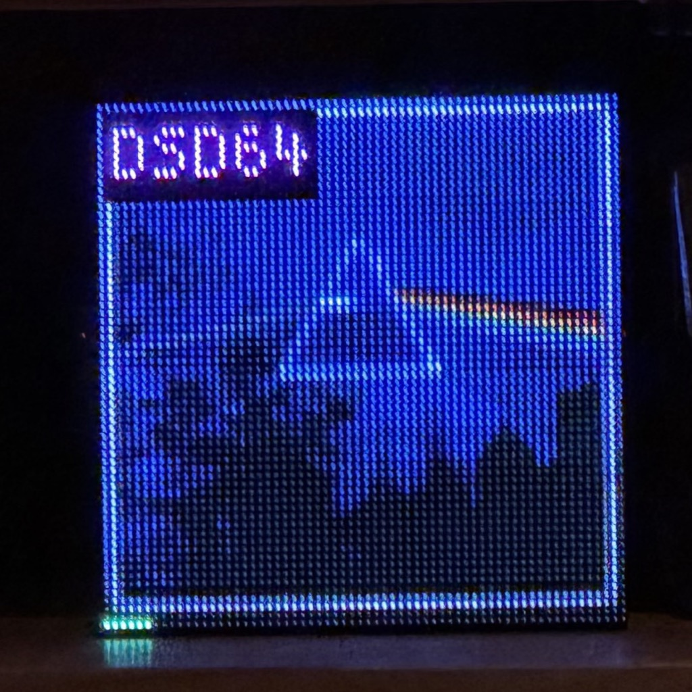
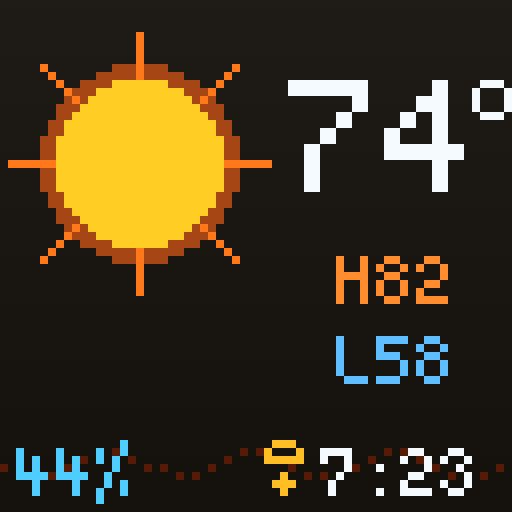
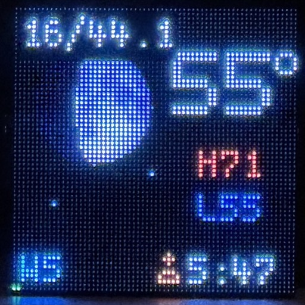
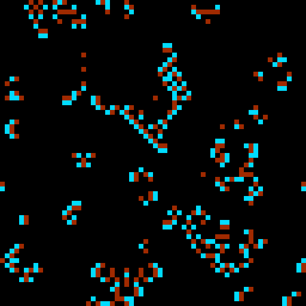

# Vinyltron

**[vinyltron.github.io](https://emuck.github.io/vinyltron/)** · Album art on a 64x64 HUB75E RGB LED matrix, driven by Volumio.

Vinyltron turns a Raspberry Pi, a Volumio player, and a small RGB matrix into a physical
music display for the room. It shows the current album art while music is playing, then
falls back to selected photos, a built-in idle image, an animated screensaver, or a weather
display when playback stops.

It is built as a Volumio `user_interface` plugin: install the zip from Volumio's plugin
manager, configure it from the plugin settings page, and let the companion daemon handle
the matrix.

## Why Vinyltron?

Right now, Vinyltron follows Volumio: when Volumio knows what is playing, the matrix shows
the artwork. The longer-term dream is broader than that. The name points at the turntable
version of the idea: listen to records through a microphone, identify the track with a
Shazam-like service, fetch the album art, and put that artwork on the matrix too.

That part is still a carrot, not a shipped feature. The current plugin is the Volumio-first
foundation for it.

## Features

- Live Volumio album art from `pushState`, resized and cropped for a 64x64 matrix
- Pause, stop, track-change, reboot, and reconnect handling without flashing stale art
- Optional progress strip with configurable height and RGB colors
- Optional compact format overlay for bitrate, sample rate, lossless, and DSD labels
- Idle modes: built-in image, selected folder image, random photo rotation, animated
  screensavers, or a weather display
- Phone-friendly photo manager for adding, selecting, deleting, and randomizing idle photos,
  with a configurable port if it conflicts with another service
- Daily display schedule for photo-frame use when music is not playing
- Volumio settings UI for display, idle image, screensaver, weather, hardware, and power
  controls

## Display modes

| Album art | Weather — clear day _(sim)_ | Weather — AQI _(sim)_ |
|:---:|:---:|:---:|
|  |  |  |

| Weather — night / moon | Brian's Brain _(sim)_ | Gray-Scott _(sim)_ |
|:---:|:---:|:---:|
|  |  |  |

_Simulator screenshots rendered from the [matrix simulator](docs/matrix-simulator.md) at 8× scale._

## Install

Vinyltron is not yet in the Volumio Plugins store, so installing it means SSHing into the
Pi and running `volumio plugin install` — Volumio's web UI no longer has a plugin-zip
upload option. Download the latest `vinyltron.zip` from
[Releases](https://github.com/emuck/vinyltron/releases/latest), then follow the
[install guide](docs/install.md) for the exact commands.

The installer builds the pinned `rpi-rgb-led-matrix` Python bindings on the Pi, installs
the `vinyltron` systemd service, and configures the boot settings needed for matrix PWM. A
reboot may be needed after the first install because boot files are changed, and the boot
changes disable onboard/HDMI audio intentionally so GPIO18/PWM remains free for the
matrix.

## Hardware Snapshot

| Part | Tested setup |
|---|---|
| Host | Raspberry Pi 3B running Volumio 4 / Bookworm |
| Matrix | 64x64 P3 HUB75E RGB LED panel |
| Interface | Adafruit RGB Matrix Bonnet #3211 recommended; direct GPIO also works |
| Matrix power | Separate 5V 4A supply |
| Wiring | Bonnet PWM mode with GPIO4-to-GPIO18 quality jumper for the cleanest output |

Pi 5 note: the plugin installs and runs in software-pulse mode on Pi 5, but actual HUB75
panel rendering on Pi 5 remains untested. Hardware-pulse mode is automatically disabled
on Pi 5 because the pinned matrix library predates RP1 GPIO support.

The Bonnet is not strictly required. Vinyltron was originally developed with direct GPIO
wiring; that path can flicker, but the effect has a certain 1980s display charm if that is
the look you want. For the most stable output, use the Bonnet in PWM/quality mode.

See [hardware setup](docs/hardware.md) for the bill of materials, power notes, Bonnet
jumper requirements, direct GPIO notes, and troubleshooting-oriented wiring checks.

## Photo Manager

The photo manager is available from a browser on the same network:

```text
http://volumio.local:3018/photos
```

The default port is `3018`. If that conflicts with another service on the Pi, change
**Photo Manager Port** in the plugin's **Idle Image** settings and save. The photo manager
restarts on the new port immediately.

The photo manager has no authentication. It is intended for a trusted home LAN, the same
basic network trust model as the Volumio web UI.

## Project Docs

For users:

- [Install guide](docs/install.md)
- [Hardware setup](docs/hardware.md)
- [Screensavers](docs/screensavers.md)
- [Current Weather](docs/weather.md)
- [Troubleshooting](docs/troubleshooting.md)

For reviewers and builders:

- [Engineering spec](docs/engineering-spec.md)
- [Matrix simulator](docs/matrix-simulator.md)
- [Verification results](docs/verification.md)
- [Changelog](CHANGELOG.md)

For maintainers:

- [Release process](docs/release.md)
- [Roadmap](docs/roadmap.md)
