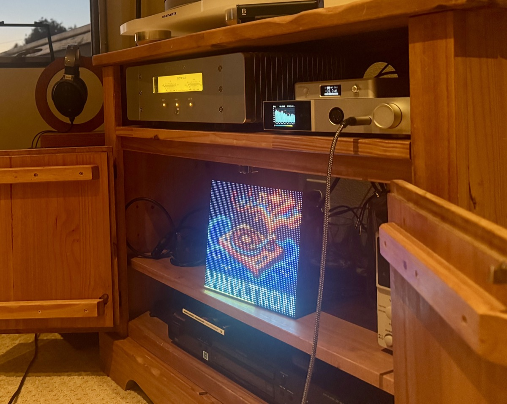

# vinyltron

Album art on a 64×64 HUB75E RGB LED matrix, driven by Volumio.



## Install

Download the latest `vinyltron.zip` from [Releases](../../releases), then in Volumio:
**Settings → Plugins → Manual Install → select the zip.**

The installer builds the rpi-rgb-led-matrix C library and Python bindings from source for
the Pi it's running on (first install only — roughly 25 minutes on a Pi 3B), bundles the
Python daemon, installs a systemd service, sets up the sudoers rules needed for service
control, and configures the boot files needed for matrix PWM (see "Pi setup" below). No
SSH required — but a reboot may be needed afterwards for the boot config changes to take
effect.

The bundled `tools/matrix-build/` helpers (`setup.py` and an `Imaging.h` stub) are custom
build helpers needed because the pinned library commit predates `pyproject.toml` — see
[engineering-spec.md](docs/engineering-spec.md#rpi-rgb-led-matrix-build) for details.

## Hardware

| Component | Part | ~Cost |
|---|---|---|
| Display | 64×64 RGB LED matrix, P3, 192×192mm | $37 |
| Interface | Adafruit RGB Matrix Bonnet #3211 | $15 |
| Matrix PSU | 5V 4A switching supply | $12 |
| Host | Raspberry Pi 3B or newer | — |

Matrix power runs on a separate 5V rail. The Bonnet handles 3.3V→5V level shifting
(74AHCT245).

**Pi 5 note**: the daemon installs and runs in software-pulse mode on a Pi 5 (armhf
userspace). Hardware-pulse mode is automatically disabled on Pi 5 — the pinned
rpi-rgb-led-matrix commit predates RP1 GPIO support and hangs the daemon if hardware
pulsing is attempted. Mounting the Bonnet also requires a tall GPIO stacking header
(~12-15mm) to clear the Active Cooler. Pi 3B is the verified reference platform for
hardware-pulse mode and panel rendering.

## Pi setup

`install.sh` automatically disables onboard audio (`dtparam=audio=off` in
`/boot/userconfig.txt`) and blacklists `snd_bcm2835` (`/boot/cmdline.txt`) so GPIO 18 is
free for matrix PWM and `adafruit-hat-pwm` hardware pulsing works — no SSH required. If
either file needed changes, the installer prints a message asking you to **reboot the
Pi** afterwards. The original `cmdline.txt` is saved as `cmdline.txt.vinyltron-orig`.

Two things remain manual:

- Close the HUB75E E-address solder jumper on the Bonnet for 64-row support
- `slowdown_gpio = 2` in `config.toml` (the default)

After rebooting, `grep '^snd_bcm2835 ' /proc/modules` should return no output.

## What it does

Subscribes to Volumio's `pushState` via Socket.io. On each track change it fetches album
art, resizes to 64×64 with LANCZOS, applies gamma correction, and pushes the frame to the
matrix. Reconnects automatically if Volumio restarts.

Optional overlays, configured in the plugin UI:

- **Progress bar** — sits at the bottom edge; height, fill color, and track color are
  all configurable
- **Format badge** — shows codec/quality (`24/192`, `320K`, `DSD64`) in the top-left
  corner once per album, then clears

When nothing is playing, the matrix shows an idle image. Set a rotation interval to cycle
through a folder of photos instead.

## Photo manager

Manage idle images from a browser on the same network:

```
http://volumio.local:3018/photos
```

Upload, pick a fixed image, delete, or enable random rotation. Uploads are converted to
64×64 PNG by the bundled Pillow helper. SSH not required.

The photo manager binds to the local network with no authentication — it is designed for
use on a trusted home LAN, the same security model as Volumio itself.

For bulk imports from a Mac:

```bash
python3 tools/convert-idle-images.py ~/Pictures/source /tmp/converted --recursive
rsync -avz /tmp/converted/ volumio@<your-volumio-ip>:/data/INTERNAL/Vinyltron/idle-images/
```

## Architecture

```
Volumio pushState (Socket.io)
        │
        ▼
  volumio_client.py  ──►  vinyltron.py  ──►  display.py
  (reconnecting              (daemon)       (image pipeline)
   subscriber)                                    │
                                                  ▼
                                        rpi-rgb-led-matrix
                                        (C lib + Python bindings)
                                                  │
                                                  ▼
                                        64×64 HUB75E panel
```

## Dev tools

`deploy.sh` — rsync source to a Pi via SSH; development shortcut, not the normal install path  
`dev-install-plugin.sh` — build and push the plugin zip to a Pi for iterative testing

## Docs

- [Engineering spec](docs/engineering-spec.md)
- [Bill of materials](docs/bom.md)
- [Hardware notes](docs/hardware-notes.md)
- [Test procedure](docs/test-procedure.md)
- [Release process](docs/release.md)
- [Roadmap](docs/roadmap.md)
- [Changelog](CHANGELOG.md)
